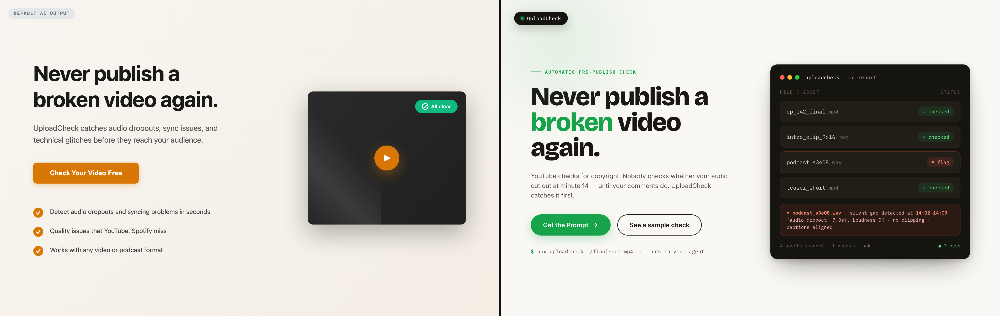
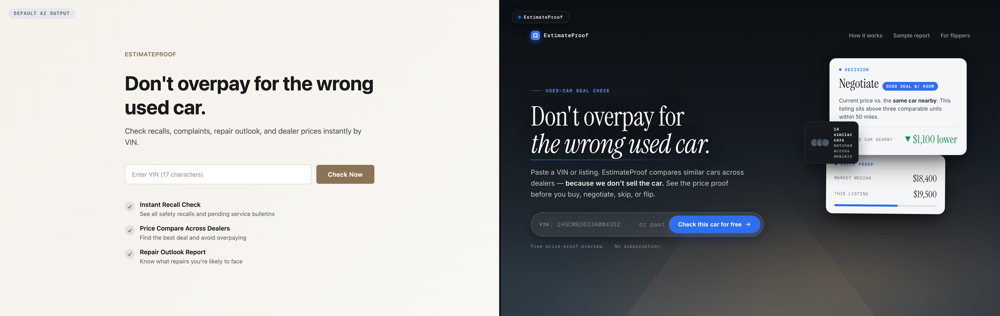
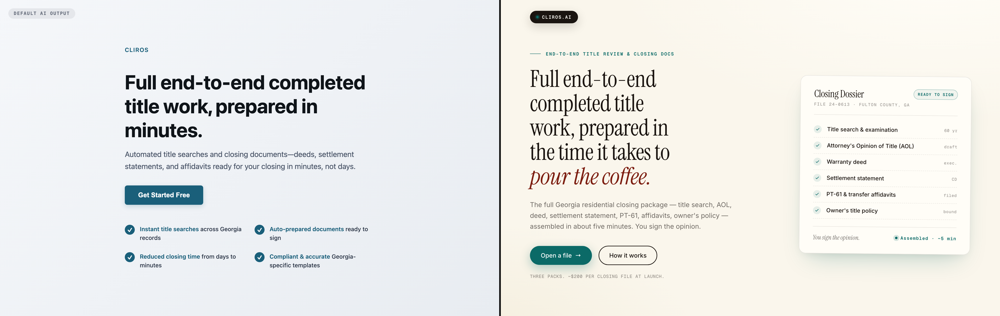

<div align="center">

# 🎨 Fable Design System

### Bring Fable-style design taste to any AI coding agent.

**A drop-in design persona for Claude, Opus 4.8, Codex, Cursor, Gemini & Antigravity — so your AI stops shipping generic Tailwind defaults and starts shipping designs people screenshot.**

[](./LICENSE)
[](#install)
[](#)

*Built by **[Dr. Antoniou](https://www.healthbrew.app)** — physician & builder.*
*Offered free for creatives & content creators by **[UploadCheck](https://www.uploadcheck.app)**.*

<br>


<sub><b>Same brand. Same copy.</b> Left: what an AI agent ships by default. Right: the same page with the Fable Design System installed.</sub>

</div>

---

## See it on four real, shipping products

Each pair below is the **same brand and the same copy** — left is a default AI agent's output, right is the same page rebuilt with the Fable Design System. These aren't mockups; the "after" matches four real sites in production.

| Product | Before → After |
|---|---|
| **[UploadCheck](https://www.uploadcheck.app)** — pre-publish media QC |  |
| **[HealthBrew](https://www.healthbrew.app)** — daily health reflection |  |
| **[EstimateProof](https://estimateproof.com)** — used-car deal check |  |
| **[Cliros](https://cliros.ai)** — real-estate closing automation |  |

<sub>The "before" pages are real, un-coached output from a fast model given a plain "build a landing page" prompt — not strawmen.</sub>

---

## What is this?

When the `fable` coding model produced UI, it had a recognizable eye: warm
editorial restraint, real typography, measured color, motion that earned its
keep — and it *critiqued its own designs by measuring them*, not eyeballing.

**Fable Design Skill** reconstructs that design instinct as a portable skill you
can install into your AI coding agent. Once installed, when you ask your agent to
build a landing page, a pricing section, a hero, or a whole site, it works like an
**award-winning SaaS designer** instead of defaulting to the same gray-Inter-on-white
template every AI ships.

It's not a UI kit or a component library. It's a **design brain** — a set of
operating instructions + concrete tokens that change *how your agent thinks about
design*.

## What changes when it's installed

Your agent will:

- ✅ **Declare a design system before building** (palette · type · spacing · motion · a11y) instead of improvising.
- ✅ **Never ship default fonts or generic Tailwind defaults** — always a real display + body + mono type pairing.
- ✅ Use **warm "paper" backgrounds** (never flat `#fff`), **one meaningful accent**, and a second color reserved strictly for warnings.
- ✅ Build with **fluid `clamp()`** type ladders and spacing, **pill CTAs**, **soft grounded shadows**, and **radius that matches the brand's voice**.
- ✅ Treat **motion with restraint** (CSS over video, `prefers-reduced-motion` always).
- ✅ **Self-critique by measuring** — checking contrast ratios and value separation, then fixing root causes.
- ✅ Verify the result **in a real browser at real breakpoints** before calling it done.

See the full spec in **[`FABLE-DESIGN-PERSONA.md`](./FABLE-DESIGN-PERSONA.md)**.

## Install

Pick your tool. Each install is a copy-paste.

<details open>
<summary><b>Claude (Claude Code / Desktop)</b></summary>

```bash
git clone https://github.com/ajantoniou/fable-design-system.git
mkdir -p ~/.claude/skills/fable-design-system
cp fable-design-system/skills/claude/SKILL.md ~/.claude/skills/fable-design-system/SKILL.md
cp fable-design-system/FABLE-DESIGN-PERSONA.md fable-design-system/EVIDENCE.md ~/.claude/skills/fable-design-system/
```

Restart Claude (or start a new session). The `fable-design-system` skill will
auto-trigger on any UI/website work. You can also drop
[`CLAUDE.md`](./CLAUDE.md) into a project root to enforce it there.
</details>

<details>
<summary><b>Codex</b></summary>

```bash
git clone https://github.com/ajantoniou/fable-design-system.git
mkdir -p ~/.codex/skills/fable-design-system
cp fable-design-system/skills/codex/SKILL.md ~/.codex/skills/fable-design-system/SKILL.md
cp fable-design-system/FABLE-DESIGN-PERSONA.md fable-design-system/EVIDENCE.md ~/.codex/skills/fable-design-system/
```

Or drop [`AGENTS.md`](./AGENTS.md) at your repo root — Codex reads it automatically.
</details>

<details>
<summary><b>Antigravity (Google)</b></summary>

```bash
git clone https://github.com/ajantoniou/fable-design-system.git
mkdir -p ~/.gemini/config/plugins/fable-design-system/skills/fable-design-system
cp fable-design-system/skills/antigravity/SKILL.md \
   ~/.gemini/config/plugins/fable-design-system/skills/fable-design-system/SKILL.md
cp fable-design-system/FABLE-DESIGN-PERSONA.md fable-design-system/EVIDENCE.md \
   ~/.gemini/config/plugins/fable-design-system/skills/fable-design-system/
```

Then add the plugin manifest (`plugin.json`) — a copy is included at
[`install/gemini/plugin.json`](./install/gemini/plugin.json). Restart Antigravity.
</details>

<details>
<summary><b>Cursor</b></summary>

Copy [`.cursor/rules/fable-design.mdc`](./.cursor/rules/fable-design.mdc) into
your project's `.cursor/rules/` directory. It auto-attaches when you edit
`.tsx`, `.css`, `.html`, or `tailwind.config.*`.
</details>

## What's in the box

| File | What it's for |
|---|---|
| [`FABLE-DESIGN-PERSONA.md`](./FABLE-DESIGN-PERSONA.md) | **The full persona** — operating method + concrete tokens for type, spacing, color, buttons, shadows, radius, animation. |
| [`EVIDENCE.md`](./EVIDENCE.md) | How the persona was derived, with honest caveats. |
| [`skills/claude·codex·antigravity/SKILL.md`](./skills) | Per-tool skill files. |
| [`CLAUDE.md`](./CLAUDE.md) · [`AGENTS.md`](./AGENTS.md) · [`.cursor/rules/`](./.cursor/rules) | Project-level rule files for each ecosystem. |

## How to use it

Just ask your agent to build UI, normally:

> "Build me a landing page hero and pricing section for a habit-tracking app."

With the skill installed, it'll declare a system, pick a real type pairing, use a
warm palette with one accent, and verify the result — instead of giving you the
default AI template. Want a specific direction? Say so ("editorial", "techy dark",
"official/spec-sheet") and the radius/type/color shift accordingly.

## Honest disclaimer

This is an **independent, community reconstruction** of a design *style*, derived
by observing publicly-recorded outputs and design reasoning. It is **not**
affiliated with, endorsed by, or an official artifact of any model provider, and
it does not contain any model weights, prompts, or proprietary material — only
original design guidance written from observed patterns. The specific token values
are illustrative starting points, not canon. See [`EVIDENCE.md`](./EVIDENCE.md).

## Credits

- **Created by [Dr. Antoniou](https://www.healthbrew.app)** — physician & builder. Also building [HealthBrew](https://www.healthbrew.app).
- **Offered free for creatives & content creators by [UploadCheck](https://www.uploadcheck.app)** — pre-publish QC for video, podcasts, and clips.

If this saved you time, a ⭐ on the repo and a share is the whole "price." Enjoy. 🎨

## License

[MIT](./LICENSE) — free to use, modify, and redistribute, including commercially.
